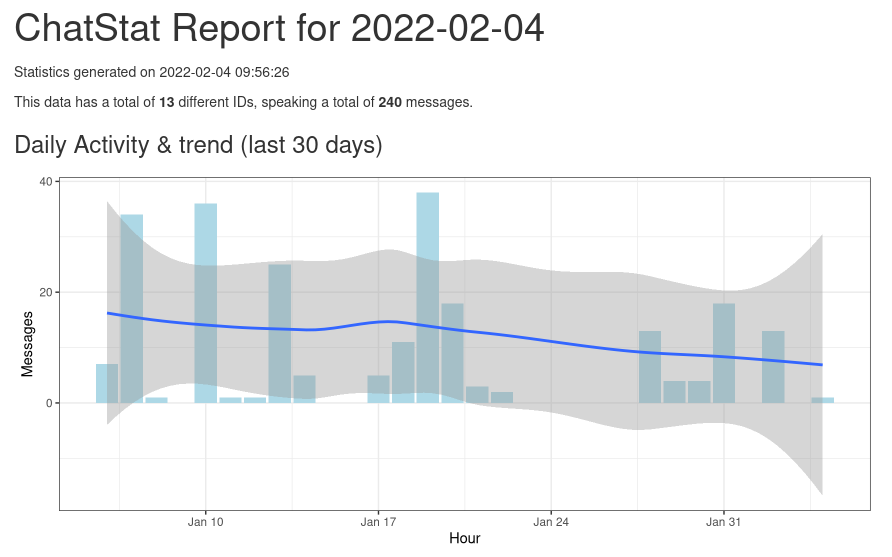

<!-- README.md is generated from README.Rmd. Please edit that file -->

```{r, include = FALSE}
knitr::opts_chunk$set(
  collapse = TRUE,
  comment = "#>",
  fig.path = "man/figures/README-",
  out.width = "100%"
)
```

# ChatStat

<!-- badges: start -->
<!-- badges: end -->

ChatStat is an R package to get data from online chat platforms, in tidy
formats. It currently only supports [Matrix](https://matrix.org), but more
backends are planned.

## Discussion

Come talk in
[#rmatrixstats:matrix.org](https://matrix.to/#/#rmatrixstats:matrix.org) to
discuss ChatStat or get help using it!

If you're new to R and are interested in learning more, you can join the [R
Matrix Space](https://matrix.to/#/#rlang:matrix.org) too!

## Installation

You can install the development version of ChatStat from
[GitHub](https://github.com/) with:

``` r
# install.packages("remotes")
remotes::install_github("GregSutcliffe/ChatStat")
```

If you're new to R, go with this approach:
``` bash
# install R from your package manager
(dnf / apt / pacman / etc) r
# make a working dir
mkdir chatstats && cd chatstats
# start r
R
```

```r
# virtual package environment
install.packages("renv")
renv::init()
# install ChatStat
install.packages("remotes")
remotes::install_github("GregSutcliffe/ChatStat")
```

Which will set up a new [renv](https://rstudio.github.io/renv/index.html)
environment with ChatStat installed and ready to use.

## Usage

### Authentication

You will need your `access_token` and your homeserver URL, and optionally a port
if your homeserver is non-standard:

```r
# Authentication
Sys.setenv('token' = 'syt_foobarbaz',
            'host' = 'matrix.org')
```

### Getting some room data
To retrieve room data initially, use `get_rooms()` like in the following
example.

```r
library(ChatStat)

room_ids <- c(
  "!layMvdZSboJeKiyTAL:matrix.org", # #rmeta:matrix.org
  "!FeFZUTDOtgIlOUoYhq:matrix.org", # #rstats:matrix.org
  "!zSgZAViSMVQLIqRgOv:matrix.org"  # #rmatrixstats:matrix.org
)

rooms <- get_rooms(room_ids, since = "2022-01-01")
```

This will store the result in `rooms` which we can take a look at:

```
> rooms
Matrix room state since 2022-01-01 

 Room ID                          Event count
 !layMvdZSboJeKiyTAL:matrix.org   39
 !FeFZUTDOtgIlOUoYhq:matrix.org   24
 !zSgZAViSMVQLIqRgOv:matrix.org   186
```

And if we dig into the `rooms` object, we can get a table of the event data:

```
> rooms$events
# A tibble: 249 × 8
   room         id    time                type  sender message_type body 
   <chr>        <chr> <dttm>              <chr> <chr>  <chr>        <chr>
 1 !FeFZUTDOtg… $164… 2022-01-04 09:12:19 m.ro… @chri… m.text       "If …
 2 !FeFZUTDOtg… $164… 2022-01-04 12:04:28 m.re… @gwmn… NA            NA  
 3 !FeFZUTDOtg… $164… 2022-01-04 18:38:00 m.re… @samf… NA            NA  
 4 !FeFZUTDOtg… $164… 2022-01-10 13:07:21 m.re… @fede… NA            NA  
...
```

### Making a report

This is what you really came for! Once you have a `rooms` object, you can call:

```r
> ChatStat::render_report(rooms)
Output created: chatstat_report.html
```

This will create an HTML report in the current directory (or you can specify a
path), which will look something like:



Obviously you can also do whatever you like with the raw data, see the
[Wiki](https://github.com/GregSutcliffe/ChatStat/wiki/A-non-R-user's-guide-to-ChatStat)
for an example of raw processing with `ggplot2`

### Saving / Loading

The `rooms` object can saved via `saveRDS(rooms,'./rooms.rds')` and loaded later
with `rooms <- readRDS('./rooms.rds')`.

### Updating

A rooms object that has been created using `get_rooms()` can be updated later
using `update_room()` which will add events that happened in the mean time.

```r
rooms_new <- update_rooms(rooms)
```
## Contributing

Contributions welcome! Please report issues as you find them, send pull requests
if you wish, or just come chat in the Matrix discussion room!
